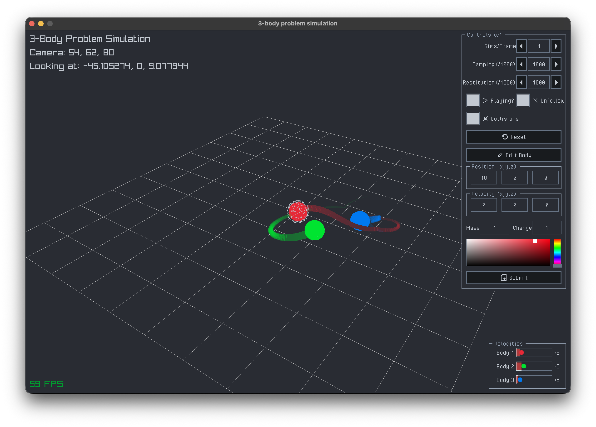

# 3-Body Problem Simulation

<div align="center">

  
  

  <p>A simulation of the 3-body problem using Zig and Raylib.</p>

</div>

<hr/>

## About



This project is a simple simulation of the 3-body problem, which is a classic problem in physics and mathematics. The simulation is implemented using the Zig programming language and the Raylib graphics library. We use classical Newtonian mechanics to simulate the gravitational interactions between three bodies in space.

## Getting Started

### Prerequisites
You only need [Zig](https://ziglang.org/download/) (version 0.15.0 or later) installed on your machine, as Raylib is included as a dependency in the `build.zig` file.

- Ensure your Zig installation is correctly set up and up to date by running:
    ```bash
    zig version
    ```

### Building and Running the Simulation
1. Clone the repository:
    ```bash
    git clone https://github.com/tathyagarg/3-body-problem.git
    cd 3-body-problem
    ```

2. Build and run the simulation using Zig:
    ```bash
    zig build run -Doptimize=ReleaseFast
    ```

3. A window should open displaying the simulation of the 3-body problem.

> [!TIP]
> Extra flags:
> - `-Doptimize=ReleaseFast` is used to optimize the build for better performance.
> - `-Djailbreak` can be added to allow for a larger range of settings values (make sure to use it responsibly).
> - `-Dscreen_width=WIDTH` and `-Dscreen_height=HEIGHT` can be used to set custom screen dimensions.

## Controls

### Movement

- `w`: Move Along +Y
- `s`: Move Along -Y
- `d`: Move Along +X
- `a`: Move Along -X
- `e`: Move Along +Z
- `q`: Move Along -Z

### Focusing
- `Left`: Focus on Previous Body
- `Right`: Focus on Next Body
- `f`: Toggle Focus Lock

### Miscellaneous
- `p` or `space`: Pause/Resume Simulation
- `r`: Reset Simulation
- `u`: Toggle UI visibility
- `c`: Toggle control panel visibility
- `Tab` or `Shift + Tab`: Cycle through control panel options

## License
This project is licensed under the WTFPL License - see the [LICENSE](LICENSE) file for details
